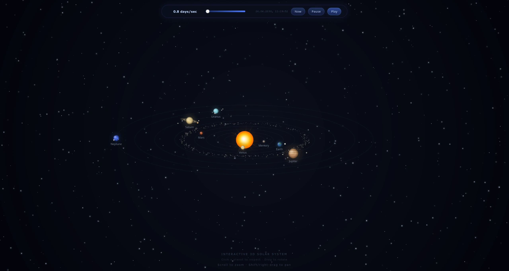

# Interactive 3D Solar System

A dependency-free, single-page pseudo-3D solar system rendered with the Canvas 2D API.



## Features

- Live and accelerated orbital motion
- Procedural rotating planet textures and axial tilts
- Planet moons with depth-aware orbital rendering
- Main asteroid belt
- World-oriented Saturn rings
- Depth sorting for the Sun, planets, moons, and asteroids
- Desktop and mobile camera controls
- Responsive, Retina-aware canvas rendering

## Controls

### Desktop

- Left-drag: rotate and tilt
- Shift + left-drag or right-drag: pan
- Mouse wheel or `+` / `-`: zoom
- Arrow keys: rotate and tilt
- Shift + arrow keys: pan
- `R`: reset camera
- Click a planet: open its information panel

### Mobile

- One-finger drag: rotate and tilt
- Tap a planet: open its information panel
- Two-finger drag: pan
- Pinch: zoom
- Double-tap empty space: reset camera

## Run locally

Open `index.html` directly, or serve the directory with any static HTTP server:

```bash
python3 -m http.server 8000
```

Then visit `http://localhost:8000`.

## GitHub Pages

1. Push the repository to GitHub.
2. Open **Settings → Pages**.
3. Select **Deploy from a branch**.
4. Select the default branch and `/(root)`.
5. Save and wait for the Pages deployment to finish.

## Accuracy

This project is an educational visualization. Orbital periods and approximate positions are represented, but object sizes, distances, textures, lighting, and some orientations are intentionally stylized and are not suitable for scientific calculations.

## License

[MIT](LICENSE)
